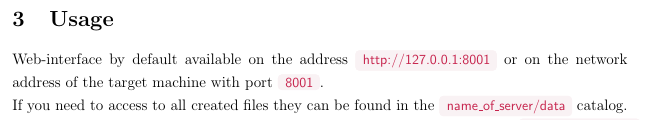

Title: Latex - Nice color boxes
Date: 08.11.2016
Modified: 01.03.2020
Author: Andrey Albershtein
Status: published
Tags: Latex, Bootstrap, code snippet
Keywords: Latex, Bootstrap, code snippet, highlighting
Slug: latex-bootstrap-code
Lang: en
Summary: How to create nice text highlighting in Latex document

Do you like those little highlighting for commands, files, code snippets and
other stuff used on the sites with Bootstrap framework? I think it's really good
for emphasizing key points in your text especially in technical writing. For
example, look at this paragraph taken from one of my documentation PDFs.



There is not too many default text decoration styles to play with to emphasize
something in Latex. Most of the times the standard **bold** and *italic* are
used. In my opinion that isn't enough and those two methods attract less
attention than fancy colorful highlightings. Try to look at some articles while
scrolling, you will see that the eye immediately catch those little red boxes.

I wrote a function for Latex, which implements this type of highlighting. All you
need to do is just add the following code to your Latex document.

```tex
% Include package for drawing color boxes
\usepackage{tcolorbox}

% Define colors
\definecolor{codeBg}{rgb}{0.976, 0.949, 0.956}
\definecolor{codeColor}{rgb}{0.780, 0.145, 0.305}

% Define new command
\newtcbox{\bCode}{
    nobeforeafter,
    fontupper=\color{codeColor},
    colframe=codeBg,
    colback=codeBg,
    boxrule=0.1pt,
    arc=3pt,
    boxsep=0pt,
    left=3pt,
    right=3pt,
    top=3pt,
    bottom=4pt,
    tcbox raise base}
```

Depending on your document settings, sometimes, you will need to change paddings 
of the box (left/right/top/bottom) to make it symmetric.

This function can be easily used with a `\bCode{your code}` command.

#### References: ####

- [Bootstrap?](http://getbootstrap.com/)
- [Latex?](https://www.latex-project.org/)
