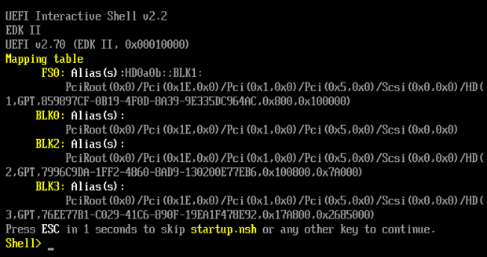

Title: Missing EFI entry for Linux
Date: 22.03.2024
Modified: 22.03.2024
Status: published
Tags: linux, boot, grub, efibootmgr, bios, nixos
Keywords: linux, boot, grub, efibootmgr, bios
Slug: missing-efi-entry
Author: Andrey Albershtein
Summary: In dual-booting system or during BIOS update, your EFI entry for booting Linux can disappear. To boot back into linux you need to get into UEFI shell
Lang: en

In dual-booting system or during BIOS update, your EFI entry for booting Linux
can disappear. To boot back into linux you need to get into UEFI shell. The
easiest way is to boot Linux from USB key. Or if you have a fancy motherboard it
can have it out of the box as one of the boot variants.

# Create Linux USB key

There's plenty of examples how to do it. I booted into Windows and used
[Rufus][1] + [Arch linux][2]. Arch already has UEFI shell built in.

# Finding Linux boot

Insert USB drive, change boot priority, boot it. You should see something like
this (I had only one UEFI shell entry):


After booting into shell you will see device list (all your HDD/SSD/NVME
drives):



Now quite tedious part. You need to find which devices is the one with Linux. I
have around 7 devices. With all partitions it ended up to be a ~17 different
items.

Mine was `BLK15` duh. To find one you can use `ls BLK15:` command. This will
list directories and files on the partition/device. You need to find one which
looks like Linux `/boot` directory, mine looks like this:

```shell
[nix-shell:~]$ tree -L 1 /boot
/boot
├── background.png
├── converted-font.pf2
├── EFI
├── grub
├── kernels
└── loader
```

You should have grub binary in there:

```shell
Shell> ls BLK15:\EFI\EFI\grub\
grubx64.efi
```

Handy commands:

- `cls` clears screen
- `map` lists all devices
- `ls` lists directory content
- `BLK15` goes into this device
- `cd dir` go to the directory

Typing `BLK15:\EFI\EFI\grub\grubx64.efi` will boot you into the grub and
then into your system. **Note!** this path can be completely different for you.
For example, mine is actually `BLK15:\EFI\NixOS-boot\grubx64.efi`.

To find out which one is correct - run it to boot. When you find the path which
boots into your system - this is the one.

# Creating EFI entry to make it permanent

After you found which `*.efi` boots your Linux system - boot into the system.
Install `efibootmgr` - this utility will make creating EFI entry very easy.

In your system list disks with `lsblk`:

```shell
[nix-shell:~]$ lsblk
NAME          MAJ:MIN RM   SIZE RO TYPE  MOUNTPOINTS
...
sdc             8:32   0 465.8G  0 disk
├─sdc1          8:33   0   550M  0 part  /boot
└─sdc2          8:34   0 465.2G  0 part
  └─crypted   254:0    0 465.2G  0 crypt
    ├─vg-swap 254:1    0     4G  0 lvm   [SWAP]
    └─vg-home 254:2    0 461.2G  0 lvm   /var/lib/containers/storage/overlay
                                         /export/alberand
                                         /nix/store
                                         /
...
```

My system disk looks as above. I have two partitions `/dev/sdc1` (or `/boot`)
and `/dev/sdc2`. The first one has my `grubx64.efi`. The second one is LUKS
encrypted `/` and `/home` of my system.

To create an EFI boot entry run:

```shell
efibootmgr ---create \
    --disk /dev/sdc \
    --part 1 \
    --label NixOS \
    --loader '\EFI\NixOS-boot\grubx64.efi'
```

- `--disk` is a disk path
- `--part` is a partition number on the disk (in my case it's 1)
- `--label` is just a name which you will see in your BIOS boot menu
- `--loader` path to the bootloader (e.g. Grub in my case)

That should be it. Reboot. Set it as default entry and you have it done.

# System doesn't boot, grub rescue>

Incorrect `--loader` can lead to a broken boot. I faced it when picked the wrong
`grubx64.efi` path. This can be debugged in the Grub rescue shell by setting
correct path:

```shell
# This was wrong path vvv
grub rescue> set
cmdpath='\EFI\GRUB\x86_64-efi'
prefix='\EFI\GRUB\x86_64-efi'
root='(hd3,gp1)'

# This how I've fixed the path and booted into the system vvv
grub rescue> set cmdpath='\EFI\NixOS-boot'
grub rescue> set prefix='\EFI\NixOS-boot'
grub rescue> insmod normal
grub rescue> normal
booting...
```

Then, after booting into your system, change the path to correct one with
`efibootmgr`. 

Use `efibootmgr --delete-bootnum --bootnum 2` to delete wrong entry at index
0002.

# References

- [Rufus][1]
- [Arch Linux Download][2] - scroll down and pick one of the mirrors, closest to
  you, or use torrents

[1]: https://rufus.ie/en/
[2]: https://archlinux.org/download/
