Title: Octave - colored prompt messages
Date: 24.10.2016
Author: Andrey Albershteyn
Status: published
Tags: Octave, colored messages, colored prompt


In Unix terminal we can use colorful output for emphasizing important pieces of 
information such as fatal errors or warnings. As a student in the Technical
University I have a lot of problem sets to solve in [Octave][1]. Its prompt is
similar to the normal Unix terminal (and I suppose it is). To make the output of
my scripts more readable I tried to implement a few function to colorize some
important messages.

The functions make usage of **fprintf** function which draw obtained text to the 
standard output or stderr (first argument is the output stream). The second
argument is construction which wraps the message passed as `msg` by special so
called ANSI escape sequences. These sequences tells prompt to display text with
some special styling such as color, underline, background color etc.

```matlab
% The set of function to print fancy messages in octave prompt. To use it just 
% call function name and as argument send a message you want to show.
% To test it use following commands:
% infom("Information message"); error("Error message"); 
% success("Success message"); head("This is head message");

% Prevent octave to run it immediately.
1;

function infom(msg)
    fprintf(1, [char(27), ...
        '[94m' msg, ...
        char(27), ...
        '[0m\n']
    );
endfunction

function error(msg)
    fprintf(1, [char(27), ...
        '[91m' msg, ...
        char(27), ...
        '[0m\n']
    );
endfunction

function success(msg)
    fprintf(1, [char(27), ...
        '[32m' msg, ...
        char(27), ...
        '[0m\n']
    );
endfunction

function head(msg)
    fprintf(1, 
        [char(27), ...
        '[90m', ...
        '==============================================================', ...
        '========\n', ...
        msg '\n', ...
        '==============================================================', ...
        '========\n',...
        char(27), ...
        '[0m']
    );
endfunction
```

Background and foreground colors can be changed in the construction shown below.
It consist of escape character `^` (or `\e`, `\033`, `\x1B`) and format
code surrounded by the **[** and **m** characters. The first number is
responsible for text formatting (normal, bold, dim, underlined...), the second
for background color and third one for foreground color. 

<div style="width: 150px; margin: 0 auto; font-size: 22px; padding: 0px 0px 5px
0px; letter-spacing: 2px;">
    ^[0;49;30m
</div>

So, the sequence above means 0 - normal text (all attributes to default), 49 -
default background color and 30 - black text color. You can found more codes at
the [following page][2] and in table below.

<style>
/* DivTable.com */
.divTable{
    display: table;
    margin: 0 auto;
    border-top: 1px #DEDEDE solid;
    border-bottom: 1px #DEDEDE solid;
    margin-top: 10px;
    margin-bottom: 10px;
}

.divTableRow {
    display: table-row;
}
.divTableHeading {
    display: table-header-group;
    background-color: #EEE;
    font-weight: bold;
}

.divTableCell, .divTableHead {
    display: table-cell;
    padding: 3px 10px;
}

.divTableHead {
    border-bottom: 1px #DEDEDE solid
}

.divTableBody {
    display: table-row-group;
};
</style>

<div class="divTable">
<div class="divTableBody">
<div class="divTableRow">
<div class="divTableHead">Code</div>
<div class="divTableHead">Color</div>
<div class="divTableHead">Preview</div>
</div>
<div class="divTableRow">
<div class="divTableCell">39</div>
<div class="divTableCell">Default</div>
<div class="divTableCell">
  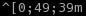
</div>
</div>
<div class="divTableRow">
<div class="divTableCell">30</div>
<div class="divTableCell">Black</div>
<div class="divTableCell">
  
</div>
</div>
<div class="divTableRow">
<div class="divTableCell">31</div>
<div class="divTableCell">Red</div>
<div class="divTableCell">
  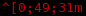
</div>
</div>
<div class="divTableRow">
<div class="divTableCell">32</div>
<div class="divTableCell">Green</div>
<div class="divTableCell">
  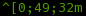
</div>
</div>
<div class="divTableRow">
<div class="divTableCell">33</div>
<div class="divTableCell">Yellow</div>
<div class="divTableCell">
  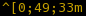
</div>
</div>
<div class="divTableRow">
<div class="divTableCell">34</div>
<div class="divTableCell">Blue</div>
<div class="divTableCell">
  
</div>
</div>
<div class="divTableRow">
<div class="divTableCell">35</div>
<div class="divTableCell">Magenta</div>
<div class="divTableCell">
  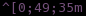
</div>
</div>
<div class="divTableRow">
<div class="divTableCell">36</div>
<div class="divTableCell">Cyan</div>
<div class="divTableCell">
  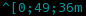
</div>
</div>
<div class="divTableRow">
<div class="divTableCell">37</div>
<div class="divTableCell">Light Gray</div>
<div class="divTableCell">
  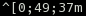
</div>
</div>
<div class="divTableRow">
<div class="divTableCell">90</div>
<div class="divTableCell">Dark Gray</div>
<div class="divTableCell">
  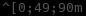
</div>
</div>
<div class="divTableRow">
<div class="divTableCell">91</div>
<div class="divTableCell">Light Red</div>
<div class="divTableCell">
  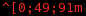
</div>
</div>
<div class="divTableRow">
<div class="divTableCell">92</div>
<div class="divTableCell">Light Green</div>
<div class="divTableCell">
  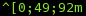
</div>
</div>
<div class="divTableRow">
<div class="divTableCell">93</div>
<div class="divTableCell">Light Yellow</div>
<div class="divTableCell">
  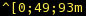
</div>
</div>
<div class="divTableRow">
<div class="divTableCell">94</div>
<div class="divTableCell">Light Blue</div>
<div class="divTableCell">
  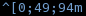
</div>
</div>
<div class="divTableRow">
<div class="divTableCell">95</div>
<div class="divTableCell">Light Magenta</div>
<div class="divTableCell">
  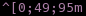
</div>
</div>
<div class="divTableRow">
<div class="divTableCell">96</div>
<div class="divTableCell">Light Cyan</div>
<div class="divTableCell">
  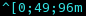
</div>
</div>
<div class="divTableRow">
<div class="divTableCell">97</div>
<div class="divTableCell">White</div>
<div class="divTableCell">
  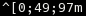
</div>
</div>
</div>
</div>

How to use it? It's easy enough, all you need to do are few follow steps:

1. Download the script
2. Create directory where you will store this script for further usage
3. Then in your Octave's config (by default it should be `~/.octaverc` on Linux
   system) add and don't forgot to change next commands:

```bash
# Change to address where your script is
addpath("/home/andrew/Documents/Octave/")
messages
PAGER_FLAGS("-r")
```

First line adds your directory to the global search. So, when you want to run
this script you can just type in the Octave prompt `messages` and this script 
will be run.

Second line runs this script. Because this configuration file (`.octaverc`) is 
run at the startup of the Octave this script will be automatically executed.
Last command add parameter to `less` program which is used when output of your
script isn't suitable for one screen of the terminal. This parameter is needed
to correctly display colors while you see output over the `less` program.

#### References: ####

- [Octave Documentation](https://www.gnu.org/software/octave/doc/v4.0.0/index.html)
- [Bash colors and
  formatting](http://misc.flogisoft.com/bash/tip_colors_and_formatting)
[1]: https://www.gnu.org/software/octave/doc/v4.0.0/index.html
[2]: https://misc.flogisoft.com/bash/tip_colors_and_formatting 
